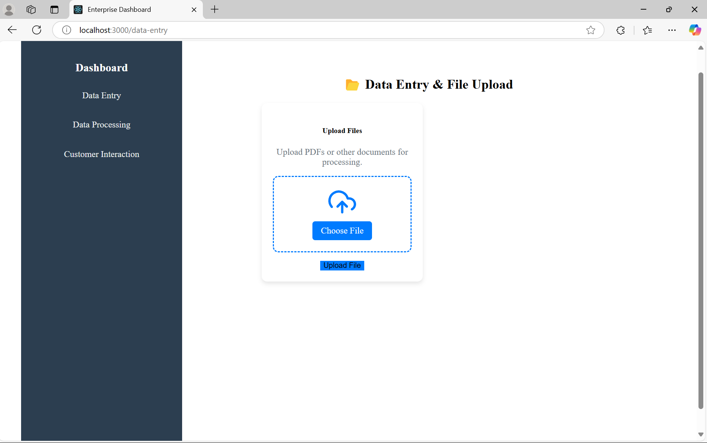

<h1 align="center">BizyEasy - Automated Business Solution</h1>

<p align="center"><em>A seamless solution to automate customer service operations.</em></p>

---

## 🚀 Overview

BizyEasy is a comprehensive platform designed to streamline your manual data entry operations with customer service processes. It automates data entry, data processing, email handling, generates support tickets, and integrates an AI-powered chatbot to enhance customer interactions—allowing your business to focus on what truly matters.

---

## 🌟 Features

✔️ **Email Automation** – Retrieves and intelligently responds to customer emails.  
✔️ **Support Ticket Management** – Generates unique support tickets for tracking and resolution.  
✔️ **AI Chatbot Integration** – Provides instant answers to common customer queries.  
✔️ **Secure Data Storage** – Stores customer and ticket data securely in MongoDB.  
✔️ **Seamless Gmail Integration** – Automates email processing with Google OAuth 2.0.  

---

## 🖥️ Screenshots


### Customer Interaction & Chatbot

*(More screenshots can be added as needed!)*

---

## 🛠️ Getting Started

### Prerequisites

Ensure you have the following installed before proceeding:

- **Python 3.7 or higher** ([Download](https://www.python.org/downloads/))
- **MongoDB** ([Download](https://www.mongodb.com/try/download/community) or use [MongoDB Atlas](https://www.mongodb.com/atlas))
- **Google Account** (for Gmail API access)

---

## 📥 Installation

### 1️⃣ Clone the Repository

```sh
git clone https://github.com/kranti424/Enterprise.git
cd Enterprise/BizyEasy
```
### 2️⃣ Create a Virtual Environment (Recommended)

```sh
python -m venv venv
# For macOS/Linux:
source venv/bin/activate
# For Windows:
venv\Scripts\activate
```
### 3️⃣ Install Dependencies
```sh
pip install -r requirements.txt
```
### 4️⃣ Set Up MongoDB
Ensure MongoDB is running (locally or via MongoDB Atlas)
Create a database named enterprise_db
Update MONGO_URI in the .env file (next step)

### 5️⃣ Configure Google OAuth 2.0
Go to Google Cloud Console
Create a new project
Enable the Gmail API
Navigate to Credentials → Create OAuth 2.0 Client IDs
Download credentials.json and place it in the BizyEasy directory

### 6️⃣ Set Up Environment Variables
Create a .env file in the BizyEasy directory and add the following:

```sh
GMAIL_API_CREDENTIALS_PATH=credentials.json
MONGO_URI=mongodb://localhost:27017/enterprise_db  # Or MongoDB Atlas URI
```
### 7️⃣ Run the Application
```sh
python app.py
The application should now be running and ready to handle email processing, ticket generation, and chatbot interactions!

Usage
Email Processing: The system will automatically listen to incoming emails, extract relevant details, and generate support tickets.
Chatbot: Customers can interact with the chatbot for quick answers to common questions.
Ticket Management: Track and resolve customer queries through the unique Ticket IDs generated.
Contributing
If you'd like to contribute to this project, feel free to fork the repository, make changes, and create a pull request. Contributions are always welcome!

License
This project is licensed under the MIT License - see the LICENSE file for details.

Support
For any issues or queries, feel free to open an issue on GitHub, and we will try to resolve it as soon as possible.

This README provides a smooth and simple installation process, making it easier for others to get started with your project. Let me know if you'd like to add or change anything!
